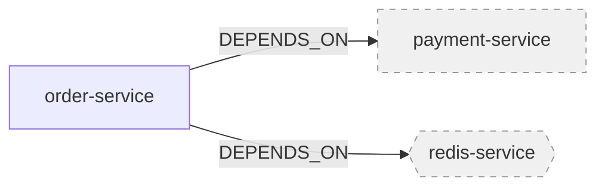

## 悬空引用的可视化处理

### 设计目标

将悬空引用（`resolved: false`）在可视化图表和状态报告中直观展示，帮助架构师快速识别和解决引用问题。

### 悬空引用的定义

悬空引用是指引用了尚未定义的实体，在数据库中标记为 `resolved: false`。常见场景：

| 场景 | 说明 | 示例 |
|------|------|------|
| **先引用后实现** | feat 内先定义引用，后续实现目标实体 | order-service 引用 payment-service（尚未创建） |
| **跨项目引用** | 引用其他项目的实体，但目标项目尚未同步 | 引用基建项目的 redis-service |
| **拼写错误** | 引用的实体 ID 拼写错误 | 引用 `paymnet-service`（拼写错误） |
| **已删除实体** | 引用的实体已被删除或废弃 | 引用已下线的 old-auth-service |

> **关键设计：状态感知的引用完整性检查**
>
> 为支持"先引用后实现"的工作流，悬空引用采用**状态感知**策略：
> - **draft/approved 状态**：允许悬空引用，只报 Warning，不阻塞保存/同步
> - **published 状态**：悬空引用报 Error，必须解决后才能发布
>
> 这避免了"无法保存因为有悬空引用，无法创建被引用实体因为无法保存"的死循环。

> **关键设计：合并视图查询**
>
> 检测悬空引用时，MCP 工具必须使用"合并视图"逻辑，避免误报：
> 1. **优先查找 feat 分支**：先在 `proposal_id` 对应的 feat 分支中查找目标实体
> 2. **回退到主分支**：如果 feat 分支未找到，再查找主分支（`proposal_id = null`）
> 3. **合并结果**：只有两处都找不到时，才判定为悬空引用
>
> **误报场景示例**：
> - 实体 A（feat 分支）引用实体 B（同在 feat 分支中新建）
> - 如果只查主分支，会误报 B 为悬空引用
> - 正确做法：先查 feat 分支，找到 B，不报悬空

> **关键设计：并发隔离**
>
> `c4a_query_deps` 等查询工具必须严格隔离不同 Feat 的数据，避免跨 Feat 污染导致的误报（Flaky Tests）：
>
> **隔离规则**：
> - 查询逻辑必须严格限定为 `proposal_id IN [current_feat_id, NULL]`
> - 绝对不能读取到其他 Feat（Feat B）的 draft 状态实体
> - 主分支数据（`proposal_id = NULL`）对所有 Feat 可见
>
> **错误示例**：
> ```typescript
> // ❌ 错误：可能读取到其他 Feat 的数据
> await mongodb.find({ status: "draft" })
>
> // ✅ 正确：严格限定 proposal_id
> await mongodb.find({
>   $or: [
>     { proposal_id: currentFeatId },
>     { proposal_id: null }
>   ]
> })
> ```

### 可视化处理策略

#### 1. 在 `/c4a:analyze` 中的悬空引用报告

在 DSL 引用正确性检查中，增加悬空引用的详细报告：

```typescript
interface CheckResult {
  status: 'pass' | 'warning' | 'error';
  issues: CheckIssue[];
  dangling_references?: DanglingReference[];  // 新增：悬空引用列表
}

interface DanglingReference {
  from_id: string;           // 引用来源实体 ID
  from_type: string;         // 引用来源实体类型
  to_id: string;             // 目标实体 ID（不存在）
  to_type?: string;          // 目标实体期望类型（用于精确匹配，避免误匹配）
  relation_type: string;     // 关系类型（DEPENDS_ON, REFERENCES 等）
  target_scope?: string;     // 目标 scope（如果是跨层级引用）
  target_project?: string;   // 目标项目（如果是跨项目引用）
  possible_causes: string[]; // 可能的原因
  suggestions: string[];     // 修复建议
}
```

**悬空引用检测规范**：

> **关键设计**：检测悬空引用时必须同时匹配 `to_id` 和 `to_type`，避免不同类型实体 ID 相同导致的误匹配。

```typescript
/**
 * 检测悬空引用（精确匹配版本）
 *
 * 误匹配场景示例：
 * - Container "redis" 和 Component "redis" 可能同时存在
 * - 引用 Container "redis" 时，不应被 Component "redis" 误匹配
 */
async function detectDanglingReferences(
  entity: Entity,
  proposal_id: string | null
): Promise<DanglingReference[]> {
  const danglingRefs: DanglingReference[] = [];

  for (const dep of entity.dependencies || []) {
    // 1. 解析引用，提取期望的目标类型
    const expectedType = inferTargetType(entity.type, dep.relation_type);

    // 2. 精确查询：同时匹配 id 和 type
    const target = await c4a_store_read({
      id: dep.target_id,
      type: expectedType,  // 关键：指定期望类型
      proposal_id
    });

    // 3. 如果精确匹配失败，记录为悬空引用
    if (!target) {
      danglingRefs.push({
        from_id: entity.id,
        from_type: entity.type,
        to_id: dep.target_id,
        to_type: expectedType,  // 记录期望类型，便于诊断
        relation_type: dep.relation_type,
        possible_causes: inferPossibleCauses(dep, expectedType),
        suggestions: generateSuggestions(dep, expectedType)
      });
    }
  }

  return danglingRefs;
}

/**
 * 根据来源类型和关系类型推断目标类型
 */
function inferTargetType(fromType: string, relationType: string): string | undefined {
  const typeInference: Record<string, Record<string, string>> = {
    'container': {
      'DEPENDS_ON': 'container',      // Container 依赖 Container
      'CONTAINS': 'component',        // Container 包含 Component
      'IMPLEMENTS': 'contract'        // Container 实现 Contract
    },
    'component': {
      'DEPENDS_ON': 'component',      // Component 依赖 Component
      'REFERENCES': 'container',      // Component 引用 Container
      'IMPLEMENTS': 'contract'        // Component 实现 Contract
    }
  };

  return typeInference[fromType]?.[relationType];
}
```

**类型推断规则表**：

| 来源类型 | 关系类型 | 期望目标类型 |
|---------|---------|-------------|
| Container | DEPENDS_ON | Container |
| Container | CONTAINS | Component |
| Container | IMPLEMENTS | Contract |
| Component | DEPENDS_ON | Component |
| Component | REFERENCES | Container |
| Component | IMPLEMENTS | Contract |
| System | CONTAINS | Container |
| ADR | REFERENCES | any（不限制类型） |

**用户交互示例**：

```
用户: "/c4a:analyze"

Agent:
🔍 一致性检查中...

✅ Functional Spec 完整
✅ Technical Spec 完整
✅ 契约完备
⚠️ DSL 引用正确性：发现 2 个悬空引用
   1. order-service → payment-service (DEPENDS_ON)
      - 目标实体不存在
      - 可能原因：
        * 目标实体尚未创建
        * 实体 ID 拼写错误
      - 建议：
        * 检查 payment-service 是否已在当前 feat 中定义
        * 确认实体 ID 拼写是否正确

   2. user-service → @infra/redis-service (DEPENDS_ON)
      - 跨项目引用，目标项目尚未同步
      - 可能原因：
        * 基建项目尚未发布
        * 基建项目尚未同步到本地
      - 建议：
        * 等待基建项目发布后执行 c4a sync
        * 或联系基建团队确认 redis-service 状态

✅ ADR 完备度检查通过
📊 实现进度：5/10 (50%)

⚠️ 检查通过，但有 1 个警告

? 如何处理？
  > 忽略警告，继续
    查看悬空引用详情
    尝试解析悬空引用
    修复引用后继续
```

#### 2. 在架构图中的可视化

使用 `c4a_visual_render_c4` 生成架构图时，悬空引用的节点和关系使用特殊样式：

**Mermaid 图表样式**：



**样式规则**：

| 元素 | 样式 | 说明 |
|------|------|------|
| **悬空节点** | 虚线边框 + 灰色填充 | 表示实体不存在 |
| **悬空关系** | 虚线箭头 + 灰色 | 表示关系未解析 |
| **正常节点** | 实线边框 + 正常颜色 | 表示实体存在 |
| **正常关系** | 实线箭头 + 正常颜色 | 表示关系已解析 |

**图例说明**：

```
图例：
━━━  正常引用（已解析）
╌╌╌  悬空引用（未解析）
```

#### 3. 在 CLI 状态报告中的展示

增加 `c4a status --dangling` 命令，专门查看悬空引用：

```bash
$ c4a status --dangling

📊 悬空引用报告

当前项目：e-commerce-platform
检查时间：2026-01-22 15:30:00

━━━━━━━━━━━━━━━━━━━━━━━━━━━━━━━━━━━━━━━━━━━━━━━━━━━━━━━━━━━━

⚠️  发现 3 个悬空引用

1. order-service → payment-service (DEPENDS_ON)
   状态：未解析
   来源：feat-a001-payment-integration
   原因：目标实体尚未创建
   建议：在当前 feat 中创建 payment-service

2. user-service → @infra/redis-service (DEPENDS_ON)
   状态：未解析（跨项目引用）
   来源：feat-a002-cache-optimization
   原因：基建项目尚未同步
   建议：执行 c4a sync

3. auth-service → old-user-db (DEPENDS_ON)
   状态：未解析
   来源：feat-a003-auth-refactor
   原因：目标实体已废弃（deprecated）
   建议：更新引用到新的 user-db

━━━━━━━━━━━━━━━━━━━━━━━━━━━━━━━━━━━━━━━━━━━━━━━━━━━━━━━━━━━━

💡 修复建议：
  - 执行 /c4a:analyze 查看详细检查报告
  - 执行 c4a sync 同步跨项目引用
  - 检查实体 ID 拼写是否正确
```

#### 4. 自动解析提示

当保存实体时，如果解析了悬空引用，自动提示用户：

```
用户: 保存 payment-service 实体

Agent:
✅ 已保存 payment-service

🔗 自动解析了 2 个悬空引用：
  1. order-service → payment-service (DEPENDS_ON)
  2. checkout-service → payment-service (DEPENDS_ON)

💡 建议：执行 /c4a:analyze 验证引用完整性
```

### 实现要点

#### 1. 查询悬空引用

```typescript
// 查询当前 feat 的所有悬空引用
c4a_store_read({
  filter: { proposal_id: "feat-a001" },
  include_relations: true,
  filter_relations: { resolved: false }
})

// 查询特定实体的悬空引用
c4a_store_read({
  id: "order-service",
  include_relations: true,
  filter_relations: { resolved: false }
})
```

#### 2. 可视化渲染

在 `c4a_visual_render_c4` 中增加悬空引用处理：

```typescript
interface RenderOptions {
  level: 'context' | 'container' | 'component';
  entity_id?: string;
  theme?: string;
  highlight_dangling?: boolean;  // 新增：是否高亮悬空引用
}

// 渲染时检查关系的 resolved 状态
function renderRelation(relation: Relation): string {
  if (relation.properties?.resolved === false) {
    return `${relation.from_id} -.->|${relation.rel_type}| ${relation.to_id}`;  // 虚线
  } else {
    return `${relation.from_id} -->|${relation.rel_type}| ${relation.to_id}`;  // 实线
  }
}
```

#### 3. 悬空引用分析

```typescript
// 分析悬空引用的可能原因
function analyzeDanglingReference(ref: DanglingReference): {
  possible_causes: string[];
  suggestions: string[];
} {
  const causes = [];
  const suggestions = [];

  // 检查是否是跨项目引用
  if (ref.target_project) {
    causes.push('跨项目引用，目标项目尚未同步');
    suggestions.push(`执行 c4a sync 同步项目数据`);
  }

  // 检查是否是拼写错误（使用模糊匹配）
  const similarEntities = findSimilarEntities(ref.to_id);
  if (similarEntities.length > 0) {
    causes.push('可能是实体 ID 拼写错误');
    suggestions.push(`检查是否应该引用：${similarEntities.join(', ')}`);
  }

  // 检查目标实体是否已废弃
  const deprecatedEntity = findDeprecatedEntity(ref.to_id);
  if (deprecatedEntity) {
    causes.push('目标实体已废弃');
    suggestions.push(`更新引用到新实体：${deprecatedEntity.superseded_by}`);
  }

  // 默认原因
  if (causes.length === 0) {
    causes.push('目标实体尚未创建');
    suggestions.push('在当前 feat 中创建目标实体');
  }

  return { possible_causes: causes, suggestions };
}
```

### 设计价值

1. **直观识别问题**：通过可视化快速发现悬空引用
2. **智能诊断**：自动分析可能原因，提供修复建议
3. **防止遗漏**：在发布前强制检查，避免发布不完整的架构
4. **提高效率**：自动解析机制减少手动维护成本

---

## CLI 交互体验优化：Diff 视图

### 设计目标

在 `c4a sync` 检测到冲突时，提供 Diff 视图，让用户清楚看到本地文件与数据库版本的差异，做出明智的决策。

### 当前问题

当前设计中，`c4a sync` 检测到冲突时仅提示"文件已修改"，用户无法直观看到差异：

```
⚠️  检测到 3 个冲突文件：
  1. .context/technical/containers/order-service.yaml
     - 本地文件已修改
     - 数据库版本已更新

? 如何处理？
  > skip    - 跳过此文件
    override - 用数据库版本覆盖本地
    keep     - 保留本地版本
```

用户可能不敢盲目选择 `override` 或 `keep`，因为不知道具体差异。

### 优化方案

#### 1. 增加 Diff 视图选项

```
⚠️  检测到 3 个冲突文件：
  1. .context/technical/containers/order-service.yaml
     - 本地文件已修改（2026-01-22 14:30）
     - 数据库版本已更新（2026-01-22 15:00）

? 如何处理？
  > diff     - 查看差异（推荐）
    skip     - 跳过此文件
    override - 用数据库版本覆盖本地
    keep     - 保留本地版本
    merge    - 手动合并（高级）

用户: diff

━━━━━━━━━━━━━━━━━━━━━━━━━━━━━━━━━━━━━━━━━━━━━━━━━━━━━━━━━━━━
📄 order-service.yaml 差异对比
━━━━━━━━━━━━━━━━━━━━━━━━━━━━━━━━━━━━━━━━━━━━━━━━━━━━━━━━━━━━

  id: order-service
  type: container
  scope: project
  name: 订单服务
- version: "1.0.0"                    # 本地版本
+ version: "1.1.0"                    # 数据库版本
  description: 处理订单相关业务逻辑

  tech_stack:
    language: typescript
    framework: express
-   database: mysql                   # 本地版本
+   database: postgresql              # 数据库版本

  dependencies:
    - payment-service
+   - notification-service            # 数据库版本新增

━━━━━━━━━━━━━━━━━━━━━━━━━━━━━━━━━━━━━━━━━━━━━━━━━━━━━━━━━━━━

📊 变更摘要：
  - 版本号：1.0.0 → 1.1.0
  - 数据库：mysql → postgresql
  - 新增依赖：notification-service

? 如何处理这个文件？
  > override - 使用数据库版本（推荐，包含最新变更）
    keep     - 保留本地版本（可能丢失数据库的更新）
    merge    - 手动合并（高级）
    skip     - 跳过，稍后处理
```

#### 2. Diff 格式说明

使用类似 Git diff 的格式：

| 符号 | 含义 | 颜色 |
|------|------|------|
| `-` | 本地版本（将被删除） | 红色 |
| `+` | 数据库版本（将被添加） | 绿色 |
| ` ` | 两个版本相同 | 白色 |

#### 3. 智能冲突分析

自动分析冲突类型，提供建议：

```typescript
interface ConflictAnalysis {
  type: 'minor' | 'major' | 'breaking';
  changes: {
    added: string[];      // 数据库版本新增的字段
    removed: string[];    // 本地版本删除的字段
    modified: string[];   // 修改的字段
  };
  recommendation: 'override' | 'keep' | 'merge';
  reason: string;
}

// 示例
{
  type: 'major',
  changes: {
    added: ['dependencies.notification-service'],
    removed: [],
    modified: ['version', 'tech_stack.database']
  },
  recommendation: 'override',
  reason: '数据库版本包含重要的架构变更（数据库迁移），建议使用数据库版本'
}
```

**冲突类型判定规则**：

| 冲突类型 | 判定条件 | 推荐操作 |
|---------|---------|---------|
| `minor` | 仅修改 description、comments 等非关键字段 | `override`（自动） |
| `major` | 修改 dependencies、tech_stack、contracts 等架构字段 | `override`（需确认） |
| `breaking` | 删除字段、修改 id、修改 type | `merge`（强制手动） |

**语义理解规则**：

```typescript
function analyzeConflict(local: Entity, remote: Entity): ConflictAnalysis {
  const changes = computeChanges(local, remote);

  // 1. 检查是否有破坏性变更
  const breakingFields = ['id', 'type', 'scope'];
  if (breakingFields.some(f => changes.modified.includes(f))) {
    return {
      type: 'breaking',
      changes,
      recommendation: 'merge',
      reason: `检测到关键字段变更（${changes.modified.filter(f => breakingFields.includes(f)).join(', ')}），需要手动合并`
    };
  }

  // 2. 检查是否有架构变更
  const architectureFields = ['dependencies', 'tech_stack', 'contracts', 'components'];
  const hasArchitectureChange = architectureFields.some(f =>
    changes.added.some(c => c.startsWith(f)) ||
    changes.removed.some(c => c.startsWith(f)) ||
    changes.modified.some(c => c.startsWith(f))
  );

  if (hasArchitectureChange) {
    return {
      type: 'major',
      changes,
      recommendation: 'override',
      reason: generateArchitectureChangeReason(changes, architectureFields)
    };
  }

  // 3. 其他为次要变更
  return {
    type: 'minor',
    changes,
    recommendation: 'override',
    reason: '仅包含描述性字段变更，建议使用数据库版本'
  };
}

function generateArchitectureChangeReason(
  changes: Changes,
  architectureFields: string[]
): string {
  const reasons: string[] = [];

  for (const field of architectureFields) {
    const added = changes.added.filter(c => c.startsWith(field));
    const removed = changes.removed.filter(c => c.startsWith(field));
    const modified = changes.modified.filter(c => c.startsWith(field));

    if (added.length > 0) {
      reasons.push(`新增 ${field}：${added.join(', ')}`);
    }
    if (removed.length > 0) {
      reasons.push(`删除 ${field}：${removed.join(', ')}`);
    }
    if (modified.length > 0) {
      reasons.push(`修改 ${field}：${modified.join(', ')}`);
    }
  }

  return `数据库版本包含架构变更（${reasons.join('；')}），建议使用数据库版本`;
}
```

### 实现要点

#### 1. Diff 算法

使用标准的 diff 算法（如 Myers diff）：

```typescript
import { diffLines } from 'diff';

function generateDiff(localContent: string, dbContent: string): string {
  const diff = diffLines(localContent, dbContent);

  return diff.map(part => {
    const prefix = part.added ? '+' : part.removed ? '-' : ' ';
    const color = part.added ? 'green' : part.removed ? 'red' : 'white';
    return chalk[color](part.value.split('\n').map(line => `${prefix} ${line}`).join('\n'));
  }).join('\n');
}
```

#### 2. 冲突分析

```typescript
function analyzeConflict(localData: any, dbData: any): ConflictAnalysis {
  const changes = {
    added: findAddedFields(localData, dbData),
    removed: findRemovedFields(localData, dbData),
    modified: findModifiedFields(localData, dbData)
  };

  // 判断冲突类型
  let type: 'minor' | 'major' | 'breaking' = 'minor';
  if (changes.modified.includes('tech_stack') || changes.modified.includes('dependencies')) {
    type = 'major';
  }
  if (changes.removed.length > 0) {
    type = 'breaking';
  }

  // 生成建议
  let recommendation: 'override' | 'keep' | 'merge' = 'override';
  let reason = '数据库版本包含最新变更';

  if (type === 'breaking') {
    recommendation = 'merge';
    reason = '检测到破坏性变更，建议手动合并';
  }

  return { type, changes, recommendation, reason };
}
```

#### 3. 配置选项

在 `.c4a.yaml` 中增加 diff 相关配置：

```yaml
sync:
  conflict_resolution:
    default_strategy: prompt  # prompt | override | keep | skip
    show_diff: true           # 是否自动显示 diff
    diff_context_lines: 3     # diff 上下文行数
    merge_tool: vscode        # 外部合并工具（vscode | meld | kdiff3）
```

### 设计价值

1. **透明决策**：用户清楚看到差异，做出明智选择
2. **降低风险**：避免盲目覆盖导致数据丢失
3. **提高效率**：智能建议减少决策时间
4. **灵活处理**：支持批量处理和手动合并

---

